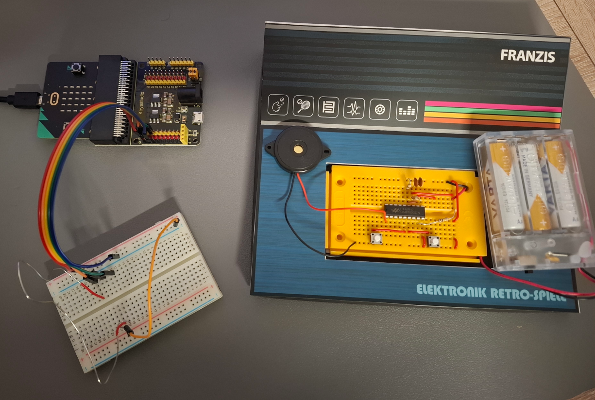

Advent of microbit
==================

My wife got me an Advent Calendar from Franzis ["Electronic-Retro Games"](https://www.amazon.de/FRANZIS-67150-Adventskalender-Selberbauen-28-seitigem/dp/B0851MXXR3).

With the first flap you get a basic setup of an electronic experimentation board. 
Each day you get some other electronic components and instruction to build or modify a little game.  

The kit includes a pre programed HT46R47 Microcontroller which does all the needed game logics.

As I saw other _Advent of Codes_ it came to my mind to kind of reprogram the game logic for each day 
to have a little more excitement. Though the target is not a complete reverse engineering of the original Firmware.
So each project will only cover the games for the day.

As I recently bought a microbit to learn embedded Rust with the
[MB2 Discovery Book](https://docs.rust-embedded.org/discovery-mb2/) it was clear which platform to use.

So here it is: **The Advent of microbit**

Further learning resources
--------------------------

A good introduction to embedded programming with Rust are the YouTube videos 

* Main setup https://youtu.be/TOAynddiu5M?si=peATEbar3KHyyq1i
* Abstraction Layers https://youtu.be/A9wvA_S6m7Y?si=lY2WVQTrhx3u-Gn1

Build and Run
-------------

I summarized the essence of the Main setup to a [.odt-File](doc/setup_embeded_rust.odt).

From the workspace root run

    cargo run --package day-XX --bin day-XX

From where I start
------------------

- I am already learning Rust since the beginning of 2025
- I have already programmed ATmega microcontrollers with C, Assembler and Arduino in the last 20 years
- I am already through the first third of the MB2 Book
